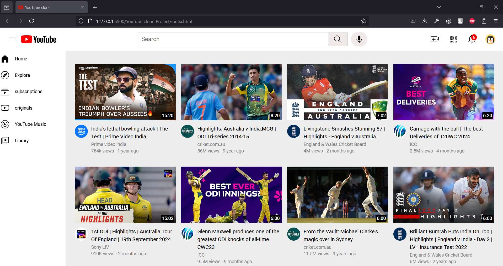

# YT-Clone

A simple YouTube clone built using **HTML** and **CSS**. This project replicates the layout and design of YouTube's homepage, showcasing my learning in creating responsive layouts and styling with Flexbox, Grid, and other CSS techniques. 

In building this project, I learned a lot of essential CSS techniques like **Flexbox** and **Grid**, and I also worked with **media queries** to make the design responsive on different screen sizes. This project was inspired by the **[Supersimpledev](https://www.youtube.com/c/supersimpledev)** YouTube course, which was fantastic in teaching these fundamental concepts.

## 🚀 Tech Stack

- **HTML**: Structure and markup of the web page.
- **CSS**: Styling and layout techniques using Flexbox, Grid, and Positioning.

## 🧑‍💻 Key Concepts Learned

During the creation of this project, I learned and applied several web development concepts:

- **Flexbox**: 
- **CSS Grid**:
- **Nested Layout Techniques**: 
- **Positioning**: 
- **Media Queries**: 

## 🎬 Features

- **Responsive Layout**: 
- **YouTube-style Homepage**:
- **Fixed Navigation Bar**: 

## 📸 Screenshots

  
*(Replace with your actual screenshot link)*

## 🔗 Project Link

[Click here to view the project on GitHub](https://nishanth-2863.github.io/Web-development-Projects/Youtube-clone-Proj/index.html)
##  ✨ Acknowledgments
I would like to express my gratitude to the following for their invaluable contributions and resources:

Supersimpledev(https://www.youtube.com/c/supersimpledev) for the amazing HTML & CSS course that helped me learn key web development concepts like Flexbox, Grid, and Responsive Design.

