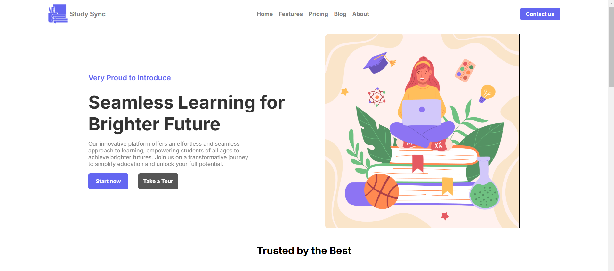
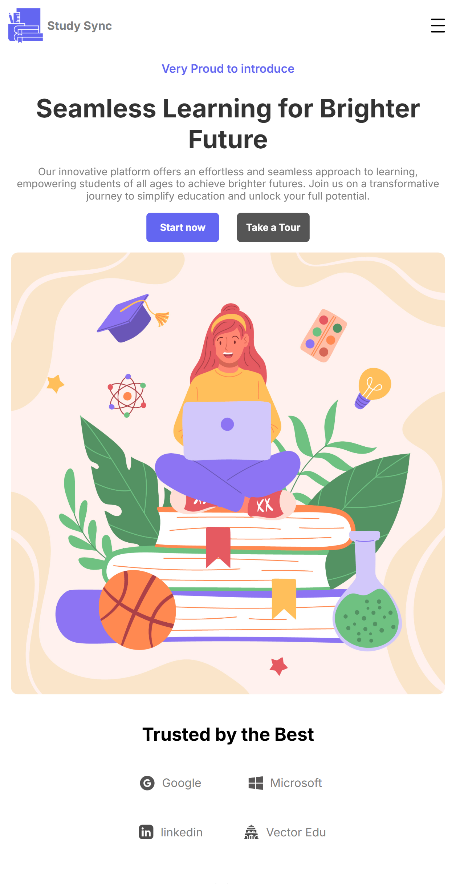

# Edutech Basic UI

This project is a simple, responsive User Interface (UI) for an Edutech platform built using HTML and CSS. The design is recreated by a project from [Love Babbar](https://www.youtube.com/@CodeHelp) and focuses on providing a clean and intuitive interface for educational content. The layout adapts seamlessly across different screen sizes to ensure a great user experience on both desktop and mobile devices.

## ✨ Features

- 📱 **Basic Responsive Design:** Optimized for various screen sizes, including mobile and desktop.
- 🎨 **Clean Layout:** A minimalistic design for an educational platform.
- 🧩 **Basic Components:** Includes headers, navigation, content sections, and footers.
- 🔧 **Predefined Design Elements:**
  - 🧭 Header with a navigation bar.
  - 🚀 Hero section with a call-to-action.
  - 📋 Cards layout for course overviews.
  - 🌐 Footer with contact and social media links.

## 🌐 Live Demo

[🚀 View the live website here](https://nishanth-2863.github.io/Web-development-Projects/eductech/index.html)

## 🖼️ Screenshots

### 🖥️ Desktop View

### 📱 Mobile View

## 🛠️ Technologies Used

- 🏗️ **HTML5** for the structure of the web pages.
- 🎨 **CSS3** for styling and responsive design.

